# Grow your business brand

(https://www.youtube.com/live/peBhSnfPe8Q)

## Pautas para construir tu marca

En primera instancia vamos investigar de que se trata y por qué es tan importante.  

### ¿Qué hace que una marca se destaque en línea?

Una marca se destaca en línea al definir claramente su propuesta de valor única, lo que la diferencia de la competencia. También es esencial conocer a su público objetivo para crear contenido relevante y atractivo. La comunicación auténtica y un tono de voz coherente ayudan a establecer una conexión más profunda con los clientes. Además, mantener una presencia activa en redes sociales, interactuando genuinamente y ofreciendo contenido útil, fortalece la lealtad y fomenta una comunidad en torno a la marca.  

### Beneficios de invertir en tu marca

* Primero, destacar entre otros negocios es crucial. Los consumidores se enfrentan a un sinfín de marcas a diario, por lo que contar con una identidad clara y memorable facilitará que te reconozcan cada vez que aparezcas, aumentando la probabilidad de que te recuerden.  

* En segundo lugar, construir confianza es esencial para establecer relaciones sólidas con los clientes. Definir cómo deseas presentarte en la web y en redes sociales es fundamental para comunicar que tu empresa es confiable y está bien establecida. Es vital que los clientes sepan qué pueden esperar de ti, lo que ayudará a fortalecer su confianza en tu marca.  

* Finalmente, incrementar la lealtad de los clientes es otro gran beneficio. Al crear una conexión emocional con tu audiencia, la personalidad de tu marca juega un papel importante. Este vínculo emocional es clave para fidelizar a tus clientes. Además, al añadir un toque humano a tu marca, no solo fortalecerás estas emociones, sino que también mejorarás la satisfacción de tu equipo, generando un ambiente de trabajo más agradable.  

### ¿Qué pautas incluye tu marca?

Existen una serie de cosas que debemos plantearnos y considerar. Obviamente nuestra marca va a tener un diseño, pero también debe tener una personalidad.  

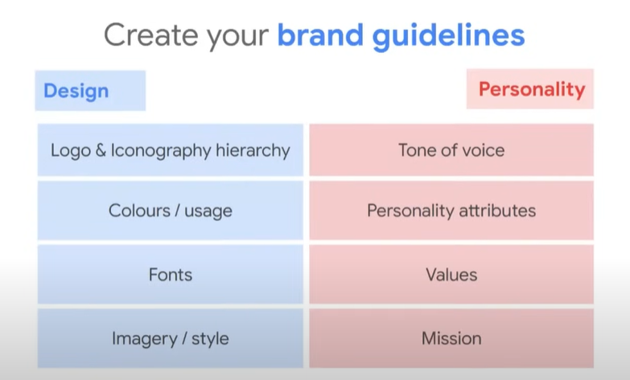  

#### Diseño:

La psicología del color nos ayuda a entender lo que cada tono puede transmitir y cómo puede influir en las emociones de los clientes al interactuar con una marca. Elegir colores que armonicen es esencial, ya que las personas suelen formarse una impresión en los primeros 90 segundos de ver una marca.  

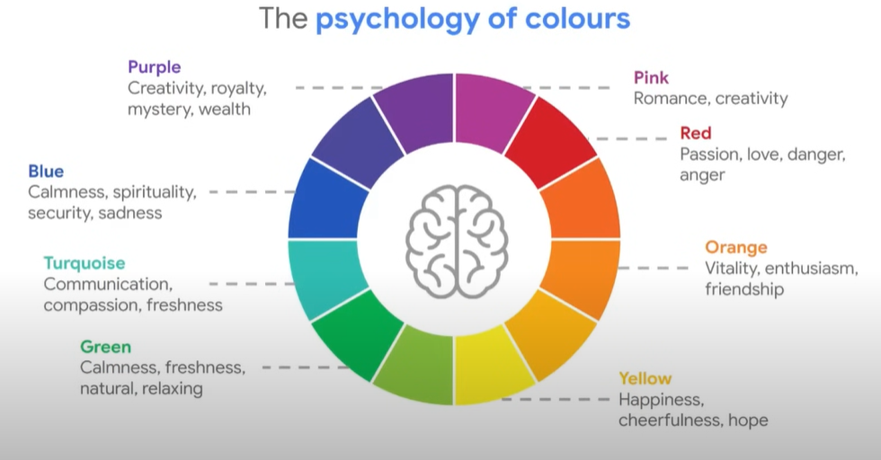  

**Colores complementarios**: Son aquellos que se encuentran opuestos en la rueda de colores, creando un contraste atractivo.  

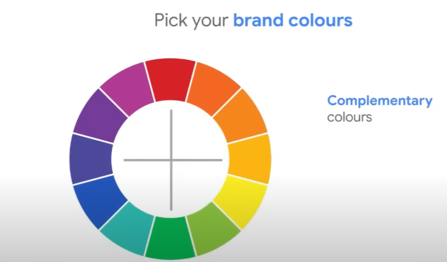  
 
**Colores análogos**: Se ubican uno al lado del otro en la rueda de colores y generan una sensación de armonía y cohesión.  

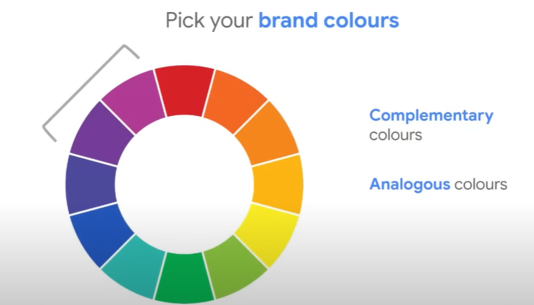  

**Triada de colores**: Se compone de tres colores que están equidistantes entre sí en la rueda de colores, proporcionando un balance vibrante y dinámico.  

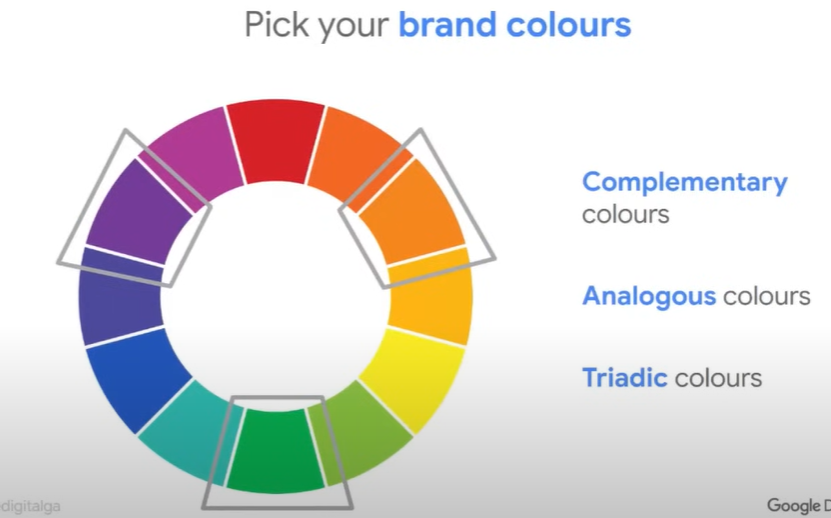  

#### ¿Qué emociones emanan los colores?

Al elegir los colores para tu marca, es importante considerar las emociones que evocan, ya que cada color puede transmitir diferentes sentimientos y asociaciones. Por ejemplo, el azul suele evocar confianza y seguridad, mientras que el rojo puede generar energía y pasión.  

Es útil investigar qué empresas utilizan ciertos colores y qué servicios o productos ofrecen. Observa a quién están dirigidos y cómo esos colores refuerzan su mensaje. Esta reflexión te ayudará a seleccionar una paleta de colores que no solo represente tu marca, sino que también conecte emocionalmente con tu público objetivo. En última instancia, los colores deben alinearse con la personalidad de tu marca y los sentimientos que deseas transmitir.  

  

#### Buscar y crear imagenes que se adaptan a tu marca

Es crucial encontrar la forma que mejor se adapte a tus necesidades para utilizar imágenes como herramientas de comunicación. Las imágenes pueden expresar ideas, servicios o productos de manera efectiva, y a menudo las personas retienen mejor la información cuando se presenta visualmente.  

Al emplear imágenes, considera su relevancia y calidad, ya que una buena imagen puede captar la atención y transmitir emociones. Además, asegúrate de que las imágenes estén alineadas con la identidad de tu marca, lo que ayuda a crear una comunicación visual coherente. En resumen, las imágenes son poderosas para comunicar y pueden ser clave para que tu mensaje resuene con tu audiencia.  

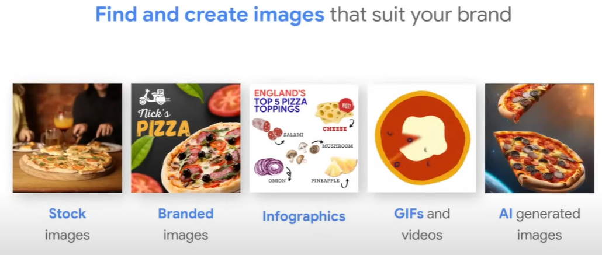  

### Personalidad: 

La personalidad de la marca es la manera en que se expresa y se relaciona con su audiencia. Se forma a través de los valores, el tono de voz y el comportamiento de la marca, y es fundamental para establecer conexiones emocionales con los clientes.  

Para definir la personalidad de tu marca, comienza identificando sus valores y principios. Pregúntate qué emociones deseas evocar y qué representa tu marca. Una vez que tengas claro esto, asegúrate de que toda comunicación, desde redes sociales hasta el sitio web, refleje esta personalidad de manera consistente.  

También es importante adaptar el comportamiento de tu marca según el contexto. Por ejemplo, puede ser juguetona en campañas de marketing y más seria en comunicaciones corporativas. Esta coherencia ayuda a diferenciarte en un mercado saturado y a fomentar la lealtad del cliente.  

 

#### Tono de voz

El tono de voz es esencial para la percepción de tu marca y la relación que construyes con tus clientes. Determina cómo te comunicas y cómo tu audiencia te percibe.  

Primero, el tono debe reflejar la personalidad de tu marca. ¿Es amigable y accesible o más formal y profesional? Esta elección influye en todo, desde las publicaciones en redes sociales hasta los correos electrónicos.  

Además, es fundamental conocer a tu público objetivo. Un tono conversacional puede atraer a una audiencia joven, mientras que un enfoque más serio puede ser mejor para un público profesional. La consistencia en el tono genera confianza y reconocimiento, por lo que cada punto de contacto con el cliente debe reflejar el mismo estilo.  

También puedes adaptar el tono según el contexto. Un tono ligero en redes sociales puede funcionar bien, mientras que un enfoque más formal es apropiado en comunicados o correos. Sin embargo, siempre debe ser auténtico y fiel a los valores de tu marca, lo que ayuda a crear conexiones genuinas con tus clientes.  

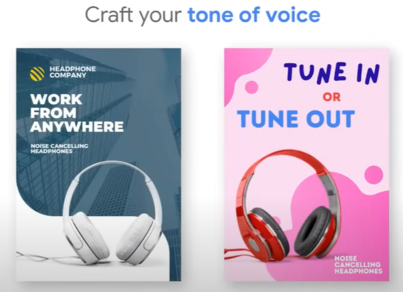  

#### ¿Qué palabras describen tu marca?

Lo ideal sería elegir algunas de estas palabras para que describan tu marca y la representen. Esto nos va a ayudar a definir el foco del marketing al que estamos apuntando, entre otros aspectos.  

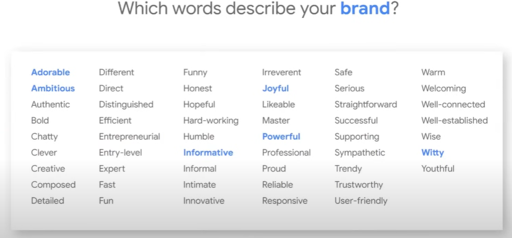  

### Misión y visión

* Es importante definir bien estos aspectos para que el enfoque de la marca siempre vaya para un mismo sentido. Acá dejo algunos ejemplos:  

1. "Nuestra visión es ser el destino definitivo para los amantes de las mascotas, ofreciendo una experiencia de cuidado incomparable y una selección curada de productos premium para mascotas que fomenten la salud, la felicidad y el bienestar de nuestros compañeros peludos."  

2. "Nuestra visión es revolucionar el futuro de la educación combinando perfectamente la tecnología y la instrucción personalizada para convertirnos en la principal plataforma global para el aprendizaje en línea interactivo y efectivo."  

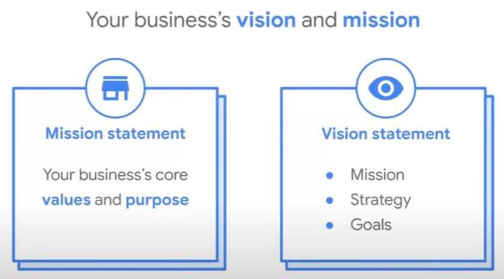  

#### ¿Cómo puedo redactar la misión y visión?

Algunas preguntas que nos van a ayudar a esto son:  

1. ¿Qué ofrecemos a los clientes? - ¿Por qué existe tu marca?
2. ¿A quién le ofreces tus servicios? - ¿Cuál es tu público objetivo?
3. ¿Qué te hace único? - ¿Qué te diferencia a vos de otros negocios similares?
4. ¿A dónde quieres que tu negocio vaya?
5. ¿Cómo sabras cuando llegaste a ese punto?  

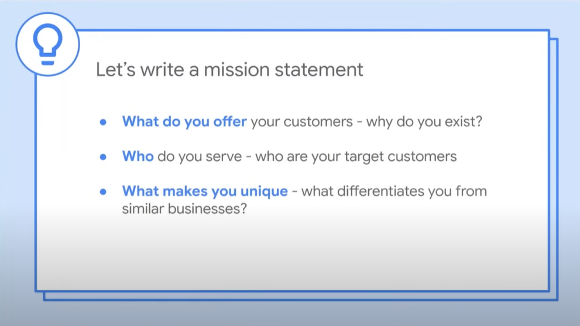  

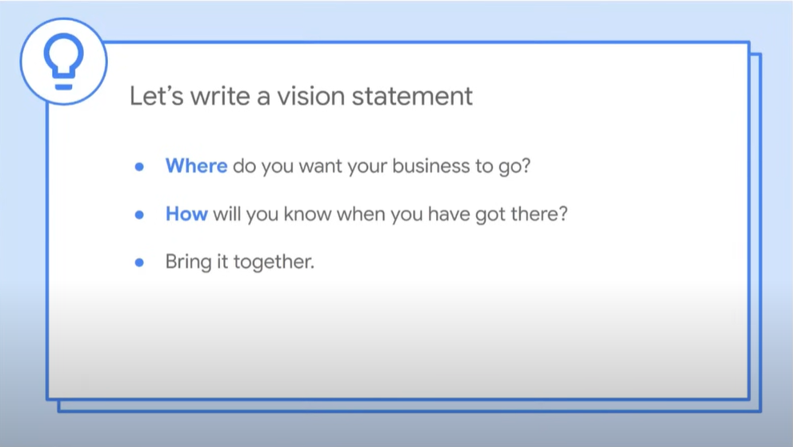  

#### ¿Cómo describir tu negocio?

Describir un negocio implica comunicar de manera clara y atractiva quién eres, qué haces y qué te distingue. Es una oportunidad para conectar emocionalmente con el cliente y dejar una impresión memorable. Aquí te presento una guía para estructurarlo:  

* ¿Quién eres?

Comienza identificando la esencia de tu negocio. Este es el momento de explicar la misión, los valores y la personalidad que te definen. Puedes compartir una breve historia sobre cómo surgió la idea, qué te motivó a emprender y el propósito que mueve a la empresa. Esta parte debe transmitir autenticidad y pasión, ayudando a los clientes a comprender quién está detrás de la marca.  

* ¿Qué haces?

Define con claridad los productos o servicios que ofreces, poniendo énfasis en cómo estos pueden mejorar la vida de tus clientes o resolver un problema. Es importante describir tus ofertas de una forma sencilla, accesible y orientada a beneficios, para que cualquiera pueda entender cómo tu negocio les puede ser útil.  

* ¿Qué te hace único?

Este es el aspecto que marca la diferencia y lo que hará que los clientes te elijan sobre otros. Aquí puedes resaltar características exclusivas de tu oferta, como la calidad, la innovación, un enfoque personalizado o una filosofía distintiva. Identifica qué valor añadido ofreces y cómo tus clientes se beneficiarán de ello de una forma que otras marcas no pueden proporcionar. Aprovecha esta sección para destacar los elementos de tu negocio que promueven una experiencia excepcional.  

Con estos elementos, tu descripción mostrará una imagen completa de lo que hace único a tu negocio, captando el interés de los clientes y diferenciándote en el mercado.  

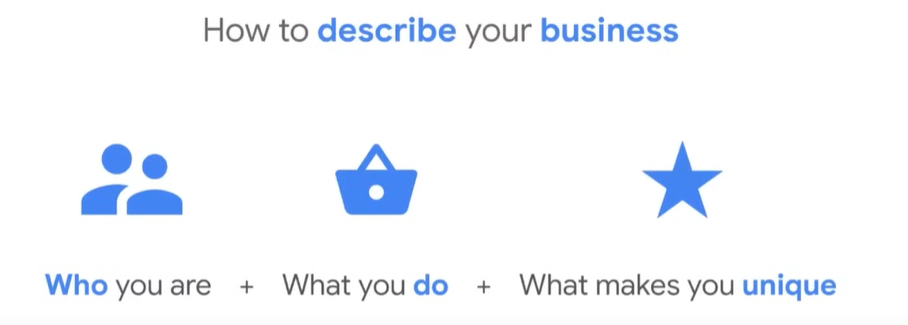  

### ¿Cómo adaptar nuestra descripción para las redes sociales?

Para crear una presencia online efectiva, comienza eligiendo un nombre que capture la esencia de tu negocio, sea memorable y represente claramente lo que ofreces. La clave está en que sea fácil de recordar y único, permitiendo que los usuarios lo identifiquen rápidamente con tu marca en medio del vasto entorno digital.  

En cuanto a la biografía, esta debe ser breve y directa, pero contener lo esencial: quién eres, qué haces y qué te hace único. La idea es que, en unas pocas palabras, transmitas tanto la misión como la visión de tu negocio, de modo que cualquier usuario pueda entender instantáneamente el valor que ofreces. Además, al añadir un toque de personalidad y autenticidad, lograrás que la descripción no solo informe, sino que también conecte.  

Por ejemplo, una biografía simple pero efectiva para una marca de productos ecológicos podría ser: “🌍 Limpieza natural para hogares seguros | Sin tóxicos, solo productos que cuidan de ti y del planeta. 🌱 #EcoHogar.” Este tipo de descripción breve es ideal para redes sociales, ya que es fácil de leer y resalta el propósito de la marca de manera clara.  

  

## Da vida a tu marca en la web

Para una empresa pequeña, es recomendable concentrarse en un número reducido de canales digitales, entre dos y cuatro, que realmente se adapten a la esencia de la marca y faciliten la interacción genuina con la audiencia. Al seleccionar estos canales, es importante considerar el embudo del cliente, una herramienta que puede ayudar a definir cuáles plataformas y estrategias resonarán mejor con el público.  

El embudo de marca funciona como una guía para desarrollar una estrategia efectiva, permitiendo a las empresas conectar de manera significativa con su audiencia. Este embudo se compone de tres etapas clave, que estructuran el recorrido del cliente desde el primer contacto hasta la conversión y la lealtad. Utilizando este marco, las empresas pueden alinear sus esfuerzos de comunicación y elegir los canales que mejor representen su mensaje, ayudando a construir una presencia en línea coherente y atractiva para el usuario.  

Una estrategia enfocada y bien orientada permite a las marcas pequeñas maximizar el impacto de sus recursos y establecer una presencia sólida en los canales más relevantes. Así, es posible dar vida a la marca en la web de una forma auténtica y efectiva, facilitando que los clientes reconozcan y valoren sus valores y propuestas.  

Estas etapas son: Concientización - Consideración - Conversión  

### Etapa de Concientización

En la etapa de concientización, el enfoque principal es captar la atención de los clientes potenciales y hacer que se familiaricen con la marca. Aquí, se busca despertar el interés inicial, generando curiosidad y atrayendo a aquellos que aún no conocen la propuesta de valor.  

Para alcanzar este objetivo, los canales de marketing como la publicidad en redes sociales y el marketing de contenidos son herramientas clave. Las redes sociales permiten llegar a una audiencia amplia y específica a través de anuncios segmentados, que pueden resaltar aspectos distintivos de la marca y sus productos. Por su parte, el marketing de contenidos—ya sea mediante blogs, videos o publicaciones informativas—ayuda a posicionar la marca como una fuente relevante de información y valor en su sector.  

Esta etapa de concientización sienta las bases para un vínculo con la audiencia, presentando la marca de manera atractiva y memorable y estableciendo el primer paso en el embudo del cliente.  

### Etapa de Consideración

En la etapa de consideración, el objetivo es profundizar la relación con los clientes potenciales, brindándoles información valiosa sobre los productos o servicios que fortalezca la confianza y credibilidad de la marca. Aquí, la marca tiene la oportunidad de demostrar su propuesta de valor de manera más concreta, ayudando al cliente a tomar una decisión informada.  

Para lograrlo, se pueden ofrecer descripciones detalladas de productos que destaquen sus beneficios y cualidades distintivas. Además, las reseñas de clientes satisfechos son una herramienta poderosa para construir confianza, ya que representan testimonios auténticos de personas que ya han experimentado el producto. Otra estrategia efectiva es proporcionar recursos gratuitos o muestras de productos, permitiendo que los clientes prueben el valor de la marca por sí mismos y se acerquen aún más al momento de decisión.  

Esta fase de consideración es crucial para solidificar el vínculo entre la marca y el cliente potencial, allanando el camino hacia una conversión exitosa.  

### Etapa de Conversión

En la etapa de conversión, el objetivo es transformar a los prospectos que ya pasaron por las fases de concientización y consideración en clientes que realizan una compra. Este es el momento culminante del recorrido del cliente, donde la marca debe enfocarse en facilitar el proceso y maximizar las posibilidades de conversión.  

Para lograrlo, es esencial crear llamadas a la acción claras y persuasivas que guíen al cliente hacia la compra. Además, es importante que el proceso de pago sea simple y libre de complicaciones, asegurando una experiencia de compra fluida y libre de barreras que puedan hacer dudar al cliente.  

Proporcionar una experiencia excepcional también es clave en esta etapa. El servicio al cliente debe ser una prioridad, ya que un soporte atento y resolutivo refuerza la confianza del cliente en la marca, aumentando las probabilidades de conversión y fidelización.  

Al comprender e implementar el embudo de marca, la empresa puede interactuar de forma efectiva con su audiencia y construir una estrategia sólida que impulse tanto el crecimiento como la lealtad de los clientes, consolidando así una relación duradera y beneficiosa con la marca.  

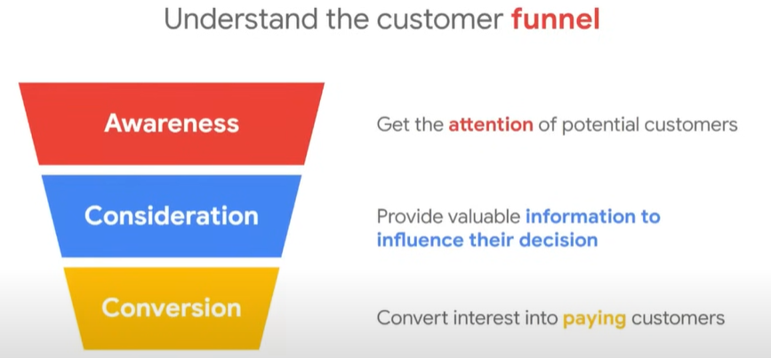  

### Mantener a tu Audiencia Atrapada

El recorrido del cliente es un proceso dinámico que va más allá de la simple transacción. Comienza con la conciencia de la marca, avanzando hacia el interés a medida que captamos la atención de nuestra audiencia. Durante esta etapa, los consumidores comienzan a evaluar los productos o servicios ofrecidos, comparándolos con las alternativas de la competencia. Este proceso es crucial, ya que es el momento en que se forman las primeras impresiones que influirán en su decisión de compra.  

Una vez que se concreta la compra, el compromiso con la marca se transforma en una experiencia real con el producto o servicio. Aquí, los consumidores desarrollan opiniones basadas en su rendimiento, calidad y satisfacción general. Estas valoraciones son poderosas, ya que los clientes satisfechos tienden a compartir sus experiencias, lo que amplifica la prueba social y puede influir en otros potenciales compradores.  

Es esencial reconocer que el recorrido del cliente no termina con la compra; de hecho, es solo el comienzo. La experiencia del usuario y las opiniones que se generan a partir de ella son fundamentales para la percepción de la marca. Fomentar una excelente experiencia post-compra no solo solidifica la lealtad del cliente, sino que también crea embajadores de la marca que comparten sus historias, influyendo positivamente en la conciencia y el interés de nuevos clientes.  

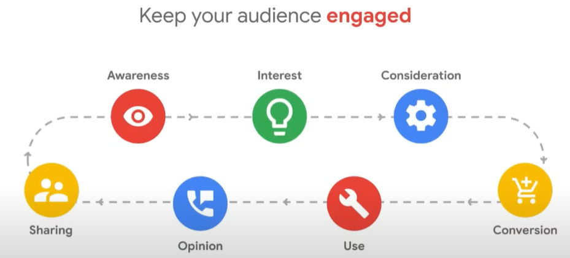  

### El Camíno de la Compra Online

Al comprar en línea, los consumidores a menudo se encuentran en un estado de búsqueda intensa, donde evalúan no solo el producto que necesitan, sino también una serie de factores adicionales, como las opiniones de otros usuarios, los detalles del producto, precios y comparaciones con alternativas. Las reseñas juegan un papel fundamental en este proceso, ya que brindan una sensación de seguridad y confianza sobre la calidad y la efectividad del producto.  

La prueba social que aportan estas opiniones es esencial; por ello, es vital generar tantas "pruebas sociales" como sea posible. Fomentar que los clientes dejen sus reseñas puede contribuir a establecer una reputación sólida y a generar confianza en la marca. Esto, a su vez, facilita la toma de decisiones de compra, ya que a las personas les gusta sentir que están realizando una buena inversión y obteniendo un valor único a cambio de su dinero.  

Incorporar estrategias como ofrecer descuentos o productos gratuitos después de una compra puede incentivar a los clientes a dejar reseñas positivas. Esto no solo aumenta la cantidad de testimonios disponibles, sino que también mejora la percepción general de la marca.  

Una vez que se han identificado los gatillos que impulsan a los consumidores a explorar y evaluar productos, es crucial asegurarse de que su experiencia de compra sea excepcional. Este enfoque no solo lleva a una mayor satisfacción del cliente, sino que también optimiza las posibilidades de conversión, transformando visitantes interesados en clientes leales.  

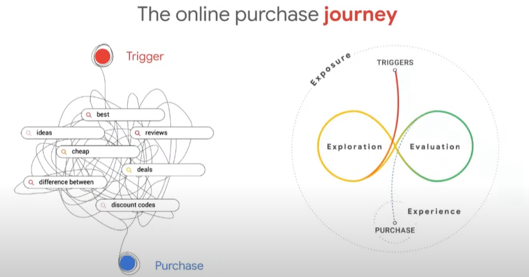  

### Grupos de Comunidades

Los grupos de comunidades son un recurso valioso para el crecimiento de una marca, ya que crean un espacio de interacción donde es posible comprender mejor a los clientes, explorando temas y necesidades que, aunque no estén directamente relacionados con la compra, pueden influir en la percepción de la marca y en futuras decisiones de compra. Este tipo de grupos permite además brindar información relevante sobre productos y servicios de manera orgánica, manteniendo una comunicación cercana y constante con la audiencia.  

Para marcas que aún no cuentan con un sitio web, los grupos comunitarios son una excelente forma de establecer contacto inicial y darse a conocer. Sin embargo, si ya se tiene presencia digital, estos espacios son igualmente útiles para canalizar el interés de la comunidad hacia la página web o tienda en línea, aumentando el tráfico y generando una mayor conexión con la marca.  

Estos grupos también son lugares donde es posible conectar con personas que comparten intereses específicos o que pertenecen a determinadas zonas demográficas, permitiendo segmentar el alcance de manera efectiva. Es fundamental, sin embargo, respetar las normas de cada comunidad, evitando prácticas como el spam que pueden dañar la reputación de la marca. Facebook, en particular, es una plataforma excelente para encontrar y participar en estos grupos.  

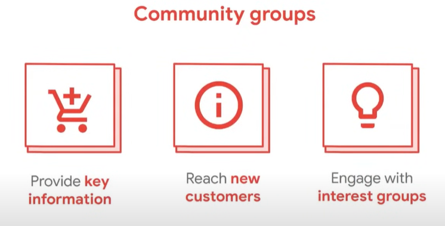  

### Chats y Mensajes

Los canales de mensajería son una herramienta poderosa para ofrecer atención e interacción rápida con los clientes, brindando un canal directo que fomenta la confianza y fortalece la relación con la marca. Al utilizar estas plataformas, los clientes pueden comunicarse de forma ágil y recibir asistencia inmediata, mejorando así su experiencia de usuario.  

Además, es posible recopilar información de contacto, como números de teléfono, siempre respetando las normativas de privacidad de datos para proteger la información personal de los usuarios. Para optimizar aún más la atención, se puede implementar un chatbot que proporcione respuestas instantáneas a preguntas frecuentes, mejorando la eficiencia del servicio.  

Herramientas como Messenger, WhatsApp y Google Business Profile son opciones efectivas para integrar este tipo de atención personalizada, ayudando a la marca a mantenerse accesible y cercana en todo momento.  

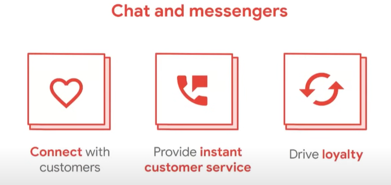  

### Contenido Corto

El contenido corto es un excelente recurso para enriquecer los canales de comunicación de la marca. Videos breves, como GIFs o clips de menos de 60 segundos, son muy populares entre la audiencia y ofrecen una representación visual efectiva que capta rápidamente la atención. Dado que muchas personas prefieren aprender y entretenerse a través de videos, este tipo de contenido permite aumentar el alcance de la marca y conectar con la audiencia de manera dinámica.  

Además, los videos cortos son una estrategia ideal para atraer nuevos clientes que quizás aún no estén familiarizados con la marca, dándoles una introducción accesible y llamativa. Plataformas como Instagram ofrecen opciones como las historias, perfectas para mostrar el detrás de escena y generar un sentido de compromiso e interacción genuina. TikTok, YouTube Shorts y LinkedIn también son alternativas viables para compartir este tipo de contenido y llegar a una audiencia amplia y diversa.  

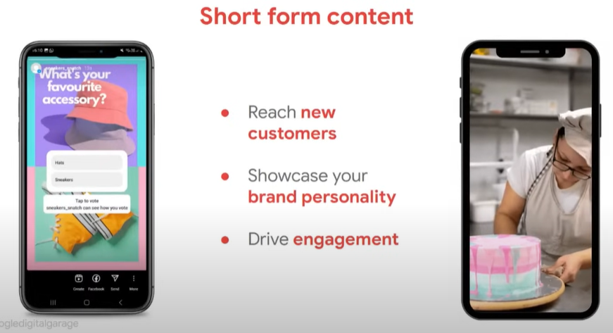  

### Contenido Largo

El contenido largo sigue siendo una estrategia fundamental en la era digital, a pesar de la sobreabundancia de opciones disponibles para el usuario. Las personas están expuestas a millones de horas de contenido de todo tipo diariamente, lo que hace necesario encontrar formas de captar y retener su atención de manera efectiva.  

Algunos datos destacan la relevancia del contenido extenso: en 2018, el 64 % de los videos creativos duraban más de 10 minutos, mostrando una preferencia por formatos que permiten desarrollar ideas con mayor profundidad. Además, plataformas como YouTube, con más de dos mil millones de usuarios registrados mensualmente, son ideales para este tipo de contenido. Cada minuto se suben más de 500 horas de video, lo que refleja una oportunidad inmensa para la difusión y visibilidad.  

Aprovechar el contenido largo no solo permite que la audiencia interactúe y profundice en el mensaje, sino también que perciba una imagen auténtica y detallada de la marca. Con este enfoque, es posible conectar a un nivel más genuino, permitiendo que el verdadero espíritu de la marca brille a través del contenido.  

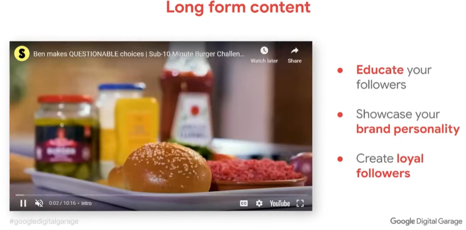  

### Linkedin

LinkedIn es una plataforma clave para conectar y construir relaciones profesionales. Un perfil completo, detallado y bien estructurado aumenta significativamente la visibilidad en búsquedas de reclutadores, maximizando las oportunidades de ser descubierto por habilidades y experiencias específicas.  

Además, LinkedIn ofrece herramientas destacadas como las recomendaciones y los respaldos, que permiten intercambiar validaciones con colegas y contactos. Al dar y recibir recomendaciones, se fortalece la percepción de credibilidad y competencia, lo que contribuye al posicionamiento de la marca personal. Los patrocinios también juegan un papel importante como prueba social, agregando un valor adicional a la reputación profesional en la plataforma.  

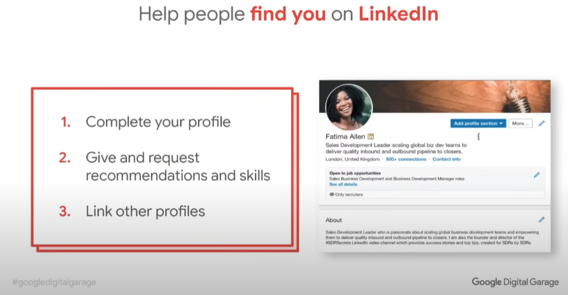  

### Newsletter y Emails

Los newsletters y correos electrónicos son herramientas altamente efectivas y rentables para mantener el contacto con los clientes y compartir información exclusiva sobre el negocio. Al aprovechar el marketing por correo electrónico, no solo extendemos el alcance de la marca a dispositivos móviles, sino que también establecemos un canal de comunicación directo, personal y valioso para la audiencia.  

La naturaleza regular del correo electrónico permite que los clientes se mantengan actualizados sobre lo que necesitan saber de nuestra marca y sobre las tendencias o novedades de la industria. Esto no solo fortalece la relación con la audiencia, sino que también impulsa el tráfico hacia el sitio web, especialmente si cada boletín incluye enlaces estratégicos.  

Plataformas como Mailchimp y Substack son excelentes para gestionar newsletters y campañas de correo electrónico. Sin embargo, es fundamental cumplir con las normativas de protección de datos, como el GDPR, garantizando que cada interacción esté en línea con los estándares de privacidad y seguridad requeridos.  

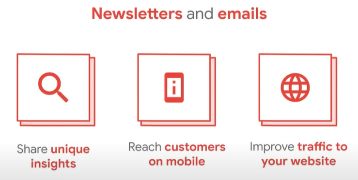  

### Blogs y Artículos

Los blogs y artículos son herramientas clave para diferenciarnos dentro de la industria. Nos permiten educar a nuestros lectores, ofreciendo información valiosa que refuerza la credibilidad y el conocimiento de nuestra marca. Además, estos contenidos no solo enriquecen nuestra plataforma principal, sino que también se pueden adaptar para compartir en redes sociales, ampliando nuestro alcance y visibilidad.  

Cada publicación contribuye a crear una identidad distintiva, permitiendo que la audiencia tenga diversas formas de acceder, explorar y absorber el contenido. A través de este enfoque multifacético, podemos asegurarnos de que la marca esté presente en múltiples canales, brindando información de manera accesible y personalizada para distintos tipos de usuarios y plataformas.  

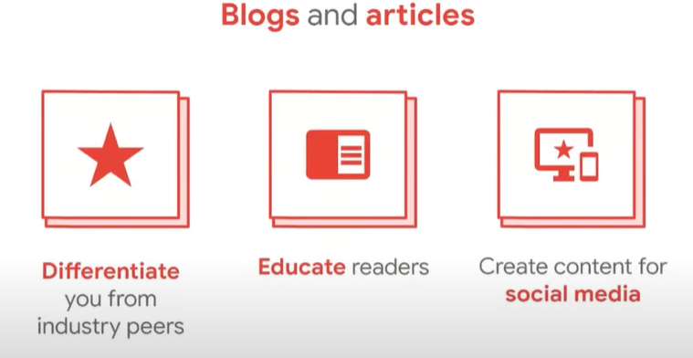  

### Estrategias para Destacar y Fortalecer la Marca en el Mundo Digital

En un mercado sobresaturado de información, es fundamental destacar ofreciendo contenido de alta calidad que capture la atención de la audiencia. Para lograrlo, resulta esencial definir y fortalecer la marca desde sus cimientos, transmitiendo autenticidad y valor en cada mensaje. De este modo, podemos crear una voz única y coherente, que se mantenga en cada publicación y que permita al público reconocer la marca al instante.  

Conectar con la audiencia es el objetivo central. La interacción constante, como responder y agradecer comentarios, contribuye a crear relaciones genuinas y a personalizar la marca, haciéndola cercana y humana. No se trata solo de comunicar, sino de escuchar activamente y responder, reforzando la sensación de que detrás de la marca hay personas reales que valoran cada interacción.  

Además, es importante ser constante en la frecuencia de publicación, cuidando de no saturar a la audiencia con contenido excesivo. Encontrar el equilibrio adecuado requiere experimentar y estar abierto a probar diferentes ritmos. Incluso, preguntar a la audiencia sobre sus preferencias de frecuencia o tipo de contenido puede ser una buena estrategia para ajustar el flujo de publicaciones a sus intereses.  

Por otro lado, la identidad visual desempeña un papel crucial. Cada aspecto, desde los colores hasta la iluminación y los ángulos, contribuye a la construcción de una presencia visual distintiva. Así, al observar cualquier pieza de contenido, la audiencia puede identificar de inmediato que pertenece a la marca, generando una conexión y recordación visual poderosas.  

Finalmente, es importante mantener una actitud abierta y flexible, adaptándose continuamente a las necesidades de la audiencia. Preguntar y evaluar qué tipo de información desean recibir o qué aspectos se pueden mejorar asegura una propuesta de contenido alineada con los intereses de quienes nos siguen, demostrando que escuchamos sus necesidades y evolucionamos junto a ellos.  

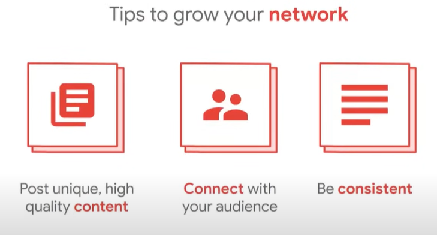  

## Usa herramientas para optimizar tu marca

Para mejorar tu marca, es fundamental comprender a tu audiencia y descubrir nuevos segmentos relevantes. Herramientas como Google Trends te permiten analizar las tendencias de búsqueda y explorar qué contenido es popular en plataformas como YouTube, ayudándote a identificar lo que la gente está buscando en todo el mundo.

Además, investigar las perspectivas del mercado a través de encuestas y análisis de datos puede proporcionarte información valiosa sobre las preferencias y comportamientos de tus clientes, lo que te permitirá adaptar tu estrategia de marca para satisfacer sus necesidades de manera más efectiva.

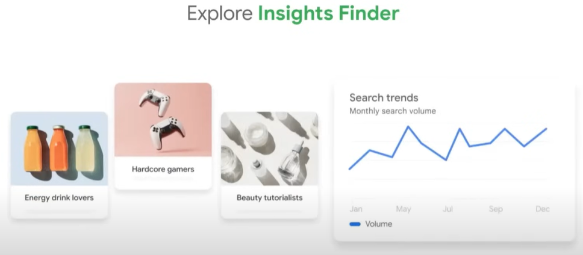  

Una herramienta valiosa como Google Trends te permite explorar lo que la gente ha estado buscando en diferentes periodos de tiempo, desde días hasta años, y a nivel mundial. Utilizando esta información, puedes publicar artículos e información relacionada con las tendencias actuales, lo que te ayudará a crear contenido relevante y atractivo para tu audiencia. Al alinear tus temas con lo que realmente interesa a las personas, podrás captar su atención y posicionar mejor tu marca en el mercado.

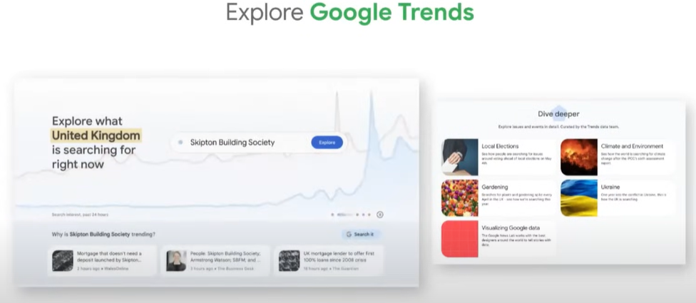  

### Herramientas para Crear Contenido

Canva es una plataforma de diseño gráfico en línea que permite a los usuarios crear contenido visual de manera fácil y rápida, sin necesidad de habilidades avanzadas en diseño. Ofrece una amplia variedad de plantillas para redes sociales, presentaciones, infografías y más, lo que facilita la personalización y la creación de gráficos atractivos. Con su interfaz intuitiva y una extensa biblioteca de imágenes, íconos y fuentes, Canva es ideal para marcas que buscan producir contenido visual de alta calidad de forma eficiente.  

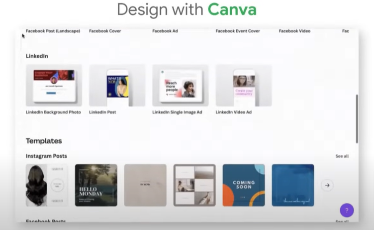  

### IA Generativa

Utilizar IA generativa para iniciar ideas puede ser una herramienta poderosa en el proceso creativo. Esta tecnología puede ayudarte a generar contenido, desde textos hasta imágenes, lo que puede inspirarte a desarrollar conceptos originales. Sin embargo, es crucial no depender completamente de la IA para el producto final. Revisa cuidadosamente lo que la IA genera, ajusta el contenido para que se alinee con tu voz y estilo de marca, y asegúrate de que sea relevante y auténtico. Este enfoque equilibrado te permitirá aprovechar la creatividad de la IA mientras mantienes la integridad de tu trabajo.  

  

### Contenido Eficiente

Remixear tu contenido es una estrategia clave para aumentar su eficiencia. Puedes reutilizar blogs, imágenes o videos en diferentes formatos, lo que te permite transformar un contenido extenso en múltiples fragmentos breves para redes sociales. Esta técnica no solo amplifica el alcance de tu mensaje, sino que también ahorra tiempo.  

Crear contenido en lotes es otra manera de adelantarte a los acontecimientos. Dedicar tiempo a planificar y producir todo tu contenido para la semana o incluso para un mes te brinda una ventaja significativa. Aunque el esfuerzo inicial puede ser considerable, el resultado compensa, permitiéndote reflexionar sobre tus objetivos y campañas mientras mantienes un flujo constante de contenido relevante.  

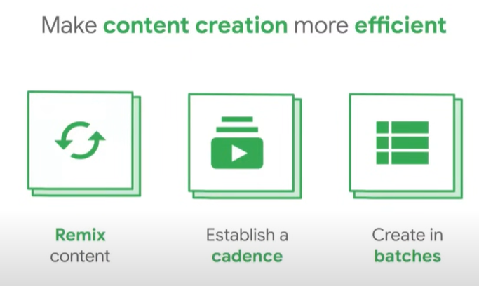  

### Contenido Interactivo

Fomentar la interacción con tus clientes es esencial para mejorar tu marca. Hacer preguntas directas a tu audiencia te proporciona valiosos comentarios sobre cómo puedes mejorar. Plataformas como Instagram y Twitter son ideales para esto, permitiéndote generar contenido temporal de formato corto a través de historias, lo que crea un sentido de urgencia y conexión.  

Además, las transmisiones en vivo son una excelente manera de involucrar a tu audiencia en tiempo real. A la gente le encanta la inmediatez, y utilizar plataformas como YouTube Live, Facebook o Instagram puede ser muy efectivo. De hecho, en 2021, se reportaron 8.2 mil millones de horas de contenido de transmisión en vivo, lo que demuestra el atractivo de este formato interactivo.  

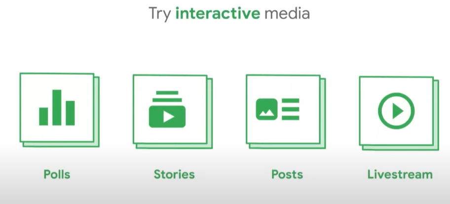  

### Herramientas para Contenido Eficiente

Existen herramientas como HubSpot y Buffer que te permiten programar contenido de manera eficiente, ayudándote a mantener una presencia constante en las redes sociales. Estas plataformas te facilitan la visualización de tu contenido programado, lo que es crucial para una estrategia efectiva.  

Probar diferentes opciones te ayudará a encontrar la que mejor se adapte a tus necesidades y a optimizar tu flujo de trabajo. Experimentar con estas herramientas puede hacer una gran diferencia en la gestión de tu contenido y en la interacción con tu audiencia.  

  

### Herramientas para Trackear Menciones

Google Alerts es una herramienta gratuita que te permite rastrear menciones de tu marca, nombre o productos en línea, enviándote actualizaciones por correo electrónico sobre lo que se dice en la web. Esto te ayuda a estar al tanto de la conversación alrededor de tu marca y a conocer la percepción pública sobre ti.  

Por otro lado, Social Mention es otra excelente herramienta que agrega contenido generado por usuarios en un flujo centralizado, similar a un canal de redes sociales. Te permite monitorear y medir en tiempo real lo que la gente dice sobre tu marca en diversas plataformas, facilitando el análisis de la reputación y la interacción en línea.  

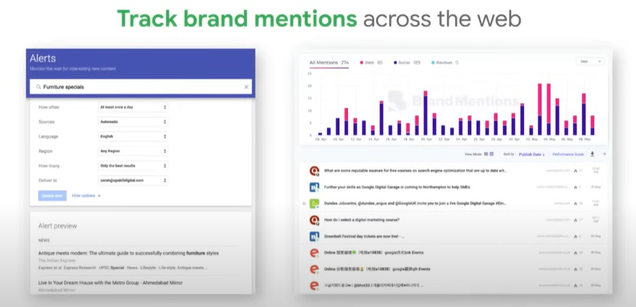  
