# Get Started with Google Analytics

https://www.youtube.com/watch?v=cYaE3wqcbko

Los temas a tratar en esta sección son sobre:

1. Hacer las preguntas correctas.
2. Aprender que herramientas usar.
3. Usar la información de Google Analytics

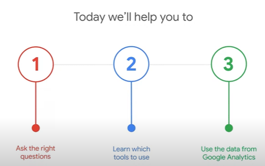

## Hacer las preguntas correctas.

Un aspecto clave al comenzar con Google Analytics es formular las preguntas correctas. La principal debe centrarse en identificar cuál es nuestro objetivo principal. Esto nos ayuda a mantener un enfoque claro y trabajar en dirección a lo que realmente importa para nuestro negocio o proyecto. Mantener esta mentalidad garantiza que nuestras decisiones estén alineadas con nuestras metas.

### ¿Cómo encuentras actualmente información sobre el rendimiento de un sitio web en línea?

Para comprender el rendimiento de un sitio web, es esencial familiarizarnos con las herramientas de análisis disponibles. Estas herramientas no solo nos muestran cómo interactúan los usuarios con nuestro sitio, sino que también nos ofrecen ventajas significativas, como identificar áreas de mejora o medir el impacto de nuestras estrategias. La información que proporcionan es clave para tomar decisiones fundamentadas, optimizar la experiencia del usuario y alcanzar nuestros objetivos con mayor eficacia.

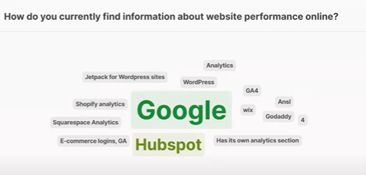

### Guía de preguntas

Para guiarnos en el analisis de la informacion es recomendable que sigamos una serie de preguntas con un unico fin para cada cosa:
1. ¿Cuál es mi objetivo?
2. ¿Qué pregunta necesito abordar?
3. ¿De dónde obtengo esa información?
4. ¿Qué hago con esa información?

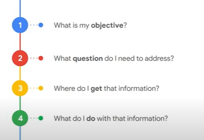

#### ¿Cuál es mi objetivo?

Definir nuestro objetivo es fundamental, ya que determina el enfoque de nuestra búsqueda de información y el propósito de nuestras acciones. Podemos tener distintas metas, como aumentar la visibilidad de nuestro negocio, incrementar las ventas de productos o servicios, identificar a los consumidores más valiosos, o descubrir nuevas maneras de conectar con clientes previos. Tener claridad sobre lo que buscamos nos permite aprovechar mejor las herramientas de análisis y alinear nuestras estrategias con nuestros objetivos específicos.

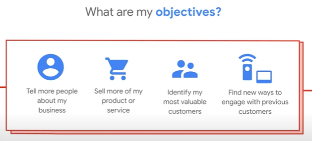

#### ¿Qué pregunta necesito abordar?

La pregunta que necesitas abordar dependerá de tus objetivos específicos. Podemos hacernos preguntas como las siguientes:

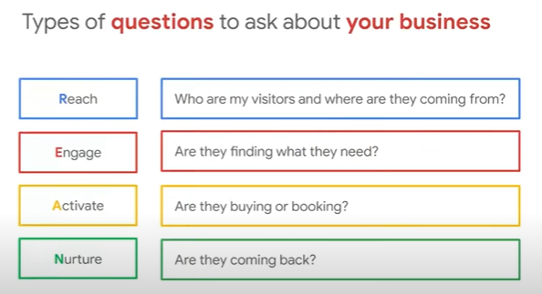

**Reach** - Esta pregunta se enfoca en la visibilidad de tu negocio y en atraer visitantes. La pregunta "Who are my visitors and where are they coming from?" busca identificar el perfil de tu audiencia y de dónde proviene el tráfico (ubicación geográfica, canales de tráfico como redes sociales, motores de búsqueda, busquedas orgánicas, etc.).

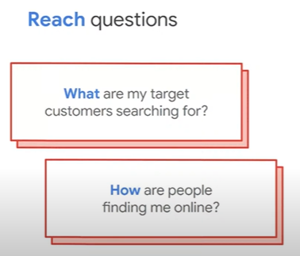

**Engage** - Aquí el objetivo es analizar si los usuarios están interesados en tu contenido o encuentran lo que buscan. La pregunta "Are they finding what they need?" se refiere a si los visitantes están interactuando de manera significativa, como explorando varias páginas o permaneciendo en el sitio lo suficiente para consumir contenido.

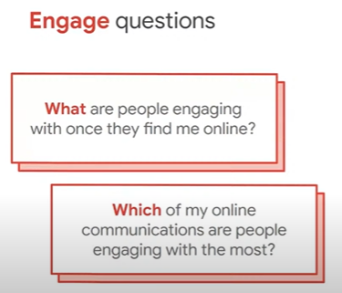

**Activate** - Esta pregunta mide las acciones de conversión, como compras o reservas. La pregunta "Are they buying or booking?" evalúa si el usuario completa una acción clave para tu negocio (completa formularios, llena la informacion de contacto, etc.).

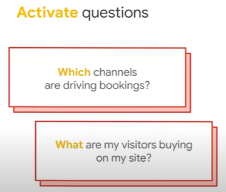

**Nurture** - Aquí se observa la lealtad y retención del usuario. La pregunta "Are they coming back?" se centra en si los visitantes retornan al sitio, lo que indica si están satisfechos o encuentran valor en lo que ofreces.

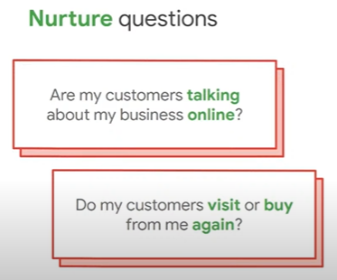

#### ¿De dónde obtengo esa información?

La fuente de los datos es clave para tomar decisiones eficaces. Herramientas como Google Analytics permiten acceder a información detallada, flexible y organizada, lo que facilita comprender el comportamiento de los usuarios en tu sitio web. Cuanta más precisión y profundidad ofrezcan los datos, más rápido y fácilmente podrás identificar áreas de mejora y definir las acciones necesarias para alcanzar tus objetivos. Escoger una herramienta adecuada garantiza que tu análisis sea eficiente y útil.

**Redes sociales:** Las redes sociales son una fuente importante de información para analizar el rendimiento de tu negocio en línea. La mayoría de estas plataformas ofrecen herramientas integradas de análisis que te permiten conocer métricas clave, como el alcance, la interacción y las características demográficas de tu audiencia. Estos datos son útiles para entender cómo tus campañas están funcionando en cada red social y para ajustar tus estrategias según los resultados obtenidos.

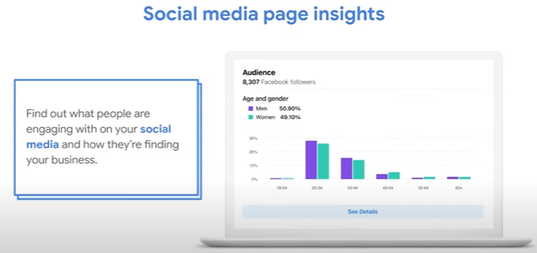

Las redes sociales no solo facilitan el análisis de datos, sino que también ofrecen múltiples **beneficios** al usar sus herramientas analíticas. Estos incluyen identificar el contenido que genera mayor impacto, obtener información demográfica de tu audiencia, medir la efectividad de tus campañas publicitarias y entender mejor a tu público para comunicarte de manera efectiva.

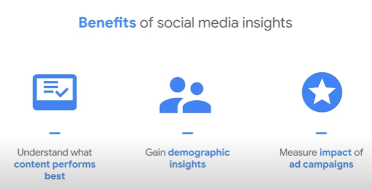

Para aprovechar al máximo estas herramientas, **sigue estos pasos:** cambia tu cuenta a una profesional o de negocio, crea y comparte contenido, revisa y analiza las métricas de tus publicaciones, y utiliza el centro de anuncios de la plataforma para medir los resultados de contenido promocionado. Además, considera usar herramientas de terceros para obtener análisis más completos y detallados.

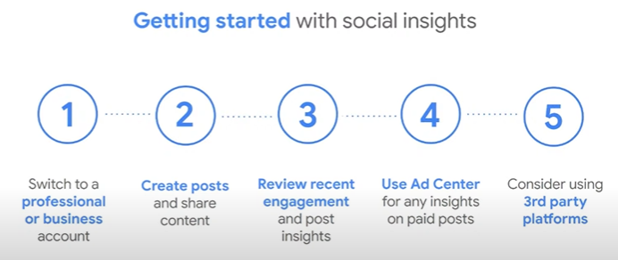

**Google Search Console** es una herramienta poderosa para obtener información valiosa sobre los visitantes provenientes de los resultados orgánicos de Google.

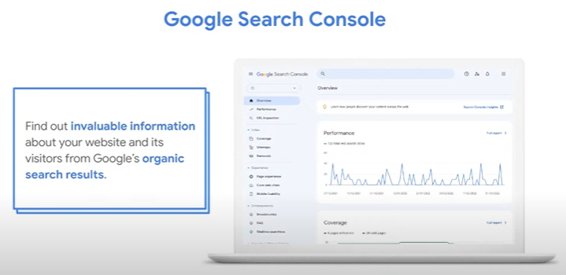

Algunos de sus principales **beneficios** incluyen verificar que Google pueda encontrar tu sitio, solucionar problemas técnicos, recibir alertas sobre nuevos inconvenientes, monitorear la frecuencia con la que tu página aparece en las búsquedas y descubrir en qué términos de búsqueda se muestra.

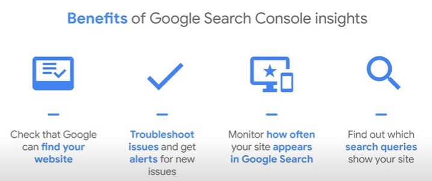

Para comenzar a usar esta herramienta, **sigue estos pasos:** accede a g.co/searchconsole, verifica la propiedad de tu página, asegúrate de que todas tus páginas hayan sido indexadas correctamente, analiza el desempeño reciente de tu sitio y familiarízate con los conceptos básicos de búsquedas en Google y SEO. Esto te permitirá optimizar tu presencia en los resultados de búsqueda y mejorar tu estrategia digital.

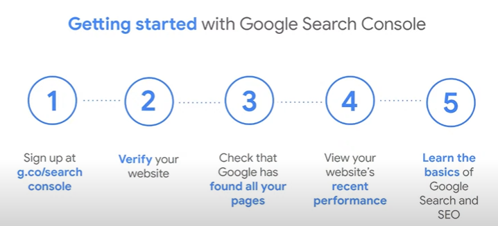

**Google Business Profile** es una herramienta esencial para gestionar tu presencia en línea a través del buscador de Google y Google Maps.

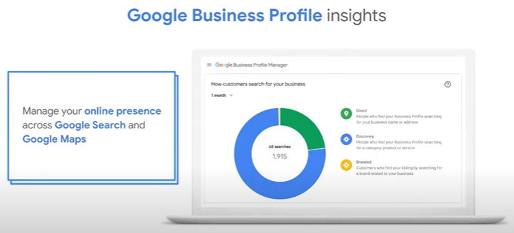

Al utilizarla, puedes obtener **beneficios** como conocer cuántas personas solicitan direcciones o hacen clic en tu página, cuántas interactúan con tu perfil de negocio, entender cómo encuentran tu negocio y qué búsquedas realizan. Esta información es clave para optimizar tu visibilidad en búsquedas y mapas.

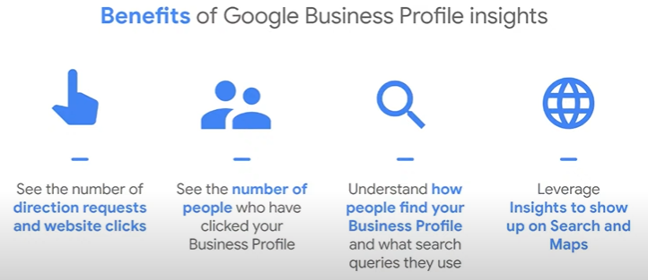

Para empezar, **sigue estos pasos:** regístrate e inicia sesión en business.google.com, busca el nombre exacto de tu negocio en Google, selecciona Promote > Performance, y elige un rango de fecha para analizar la información relevante. Esto te permitirá tomar decisiones informadas para mejorar tu estrategia de presencia local.

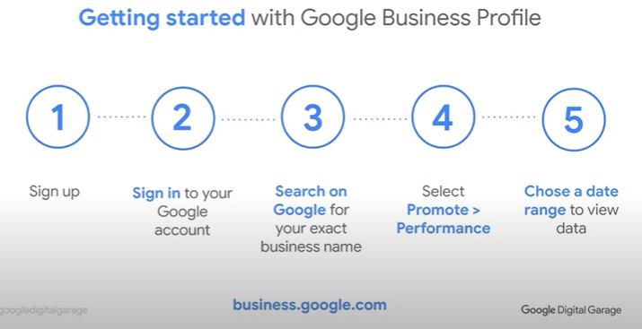

**PageSpeed Insights** es una herramienta eficaz para analizar el rendimiento de tu página web.

Algunos de los **beneficios** de utilizarla incluyen evaluar qué tan rápido carga tu página, obtener recomendaciones sobre posibles mejoras, aprender a optimizar tu sitio para mejorar la experiencia del usuario y recibir un reporte detallado sobre el rendimiento.

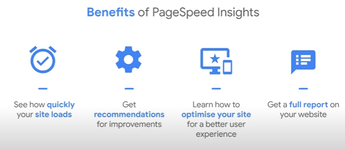

Para utilizar esta herramienta, **sigue estos pasos:** visita pagespeed.web.dev, ingresa la URL de la página que deseas analizar, revisa la puntuación y las sugerencias que te proporciona, personaliza e implementa las mejoras recomendadas, y selecciona un rango de fechas para obtener un análisis más específico de tu sitio web.

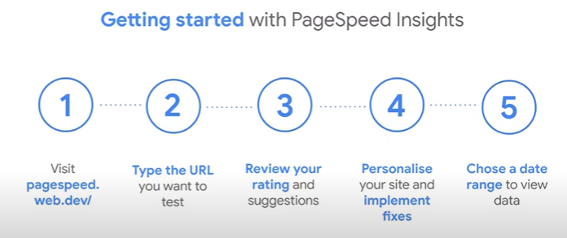

Con **Google Analytics**, puedes analizar el comportamiento de los usuarios en tu página web, incluyendo cada clic que realizan, lo que te ayuda a comprender cómo interactúan con tu contenido. Además, puedes gestionar tu presencia online a través de los buscadores de Google y Google Maps, lo que te permite optimizar tu visibilidad y atraer más visitantes.

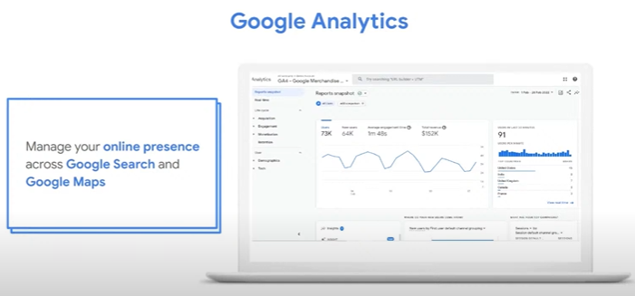

Algunos de los **beneficios** de utilizar Google Analytics incluyen evaluar el rendimiento de tus campañas de marketing, entender el comportamiento de tus clientes, conocer más sobre tus usuarios y sus preferencias, y vincularlo con otras herramientas de métricas, como Google Ads, para obtener una visión más completa de tu estrategia digital.

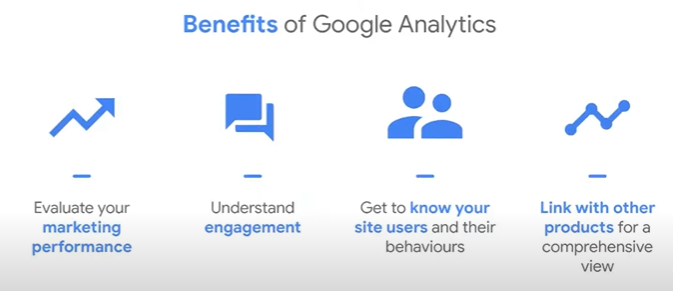

#### ¿Qué hago con esa información?

Muchas veces, las personas se sienten abrumadas por los "números" y datos obtenidos a través de herramientas de análisis, pero saber cómo interpretarlos y qué hacer con ellos marca una gran diferencia. Lo primero es tener claro qué estás buscando al recolectar información. Si tu objetivo es aumentar las ventas, por ejemplo, puedes enfocarte en identificar los puntos débiles del embudo de ventas, como páginas con alta tasa de rebote o bajos tiempos de interacción. Si buscas mejorar la experiencia del usuario, puedes analizar la velocidad de carga, la usabilidad o las páginas más vistas. Tener un panorama claro de lo que buscas te permite tomar decisiones informadas y aplicar cambios estratégicos, como optimizar contenido, mejorar la navegación o ajustar campañas publicitarias.

**Google Analytics 4**

Google Analytics 4 es la nueva versión de la herramienta que integra machine learning como su núcleo para ayudarte a descubrir insights, tendencias y realizar predicciones a través de todos los dispositivos. Esta actualización permite obtener análisis más profundos y personalizados de los comportamientos de los usuarios, mejorando la capacidad de tomar decisiones basadas en datos.

Para migrar a Google Analytics 4, primero asegúrate de haber conectado tu sitio web a la plataforma (puedes buscar los pasos específicos en Google). Luego, sigue estos pasos: ingresa a tu cuenta de Google Analytics, navega hacia el panel administrativo, selecciona la propiedad que deseas asignar a Google Analytics 4, y haz clic en GA4 Setup Assistant. Sigue las instrucciones que aparecen para completar el proceso de configuración.

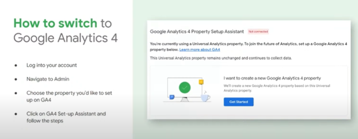

**Reportes de Google Analytics** 

Con esta herramienta podemos generar diferentes tipos de reportes. Algunos de los principales incluyen:

**Adquisición**: Estos reportes te muestran de dónde provienen tus usuarios, es decir, qué canales están generando tráfico hacia tu sitio (como búsquedas orgánicas, redes sociales, o tráfico directo).

**Compromiso**: Te ayudan a entender cómo los usuarios interactúan con tu sitio web, cómo navegan por las páginas, cuánto tiempo pasan en ellas y qué tipo de contenido atrae más su atención.

**Monetización**: Se enfoca en cómo los usuarios gastan su dinero en tu sitio, es decir, las compras o conversiones realizadas a través de tus páginas, permitiéndote evaluar la efectividad de tus estrategias de ventas.

**Retención**: Este reporte analiza si los usuarios regresan a tu sitio después de su primera visita, lo que te permite medir la lealtad y el valor a largo plazo de tu audiencia.

Estos reportes son fundamentales para comprender el comportamiento de tus usuarios y tomar decisiones informadas sobre cómo mejorar cada etapa de su experiencia.

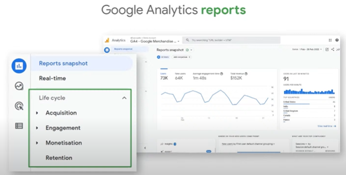

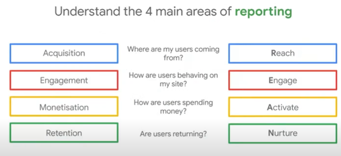
