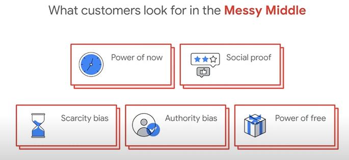
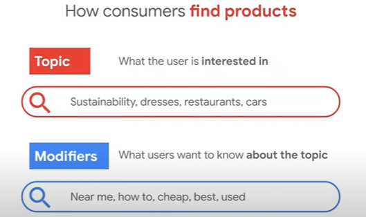
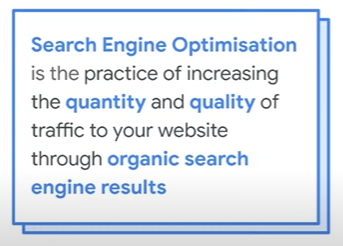

# Get Your Business Visible on Google

[Charla original](https://www.youtube.com/watch?v=Fiym37h84mI)

Los temas a tratar en esa sección son sobre:
1. Comprender cómo los cliente encuentran tu negocio en línea.
2. Mostrar tus productos en Google
3. Construir nuestra presencia en Google Maps y en los buscadores.

## Comprender cómo los cliente encuentran tu negocio en línea 

Para que un negocio sea visible en internet, es fundamental comprender la forma en que los clientes buscan y descubren productos o servicios en línea. Ponerse en el lugar de la audiencia y pensar como ellos permite construir una presencia digital sólida que responda a sus necesidades y expectativas. Es común que los compradores investiguen a las marcas en redes sociales antes de tomar una decisión de compra; por lo tanto, asegurar que tu negocio esté visible y accesible en estos espacios es esencial. Esto significa no solo tener perfiles activos, sino también generar contenido relevante y auténtico que atraiga la atención y fomente la confianza del cliente.

### ¿Cómo utilizan los clientes los motores de búsqueda para encontrar empresas y productos?

La forma en que los consumidores usan los motores de búsqueda para investigar productos y servicios destaca la importancia de tener una presencia online optimizada y atractiva. En el Reino Unido, el 80% de los consumidores compra en línea, y esta cifra sigue en aumento. Además, un 70% de las personas consulta resultados sobre tiendas físicas antes de decidir visitarlas. Esta tendencia muestra que, en lugar de ir directamente a una tienda, los consumidores suelen investigar desde cualquier lugar y en cualquier momento: ya sea tomando un café, en el tren o mientras hacen otras actividades. La mayoría de estas búsquedas se realizan desde teléfonos móviles, lo que refuerza la necesidad de contar con un sitio web que sea fácil de navegar desde dispositivos móviles.

Asimismo, el 62% de los compradores usa Google para comparar productos de distintos vendedores antes de tomar una decisión. Esto implica que el contenido y la presentación de los productos y servicios en línea influyen directamente en las decisiones de compra. Para captar la atención de los clientes, es fundamental proyectar una imagen clara, profesional y coherente que facilite la comprensión de lo que ofreces. Una presencia online bien diseñada no solo aumenta la visibilidad de la marca, sino que también mejora la posibilidad de que el cliente te elija frente a la competencia.

### El camino de la compra online

El proceso de compra online es todo menos lineal; en realidad, puede ser un camino caótico y lleno de decisiones intermedias. Los consumidores no siguen una ruta fija al buscar productos o servicios; en cambio, su experiencia de compra está influenciada por múltiples variables y pasos interconectados. Esto puede incluir desde el descubrimiento inicial de un producto hasta las revisiones de alternativas, el análisis de opiniones y la comparación de precios. Los comentarios y reseñas de otros compradores se vuelven elementos cruciales en esta ruta, pues ayudan a los consumidores a tomar decisiones más informadas y a tener confianza en lo que están adquiriendo.

Dada la naturaleza de este "camino de compra desordenado," es esencial que las empresas mantengan una presencia activa y sólida en redes sociales. Estar presente en estos espacios no solo mejora la visibilidad de la marca, sino que también facilita el acceso a opiniones, interacciones y contenido relevante que puede influir directamente en la decisión de compra de un consumidor.

#### ¿Qué es lo que buscan los consimudores en el medio de ese desorden?

A pesar del camino caótico que suelen recorrer los consumidores en su experiencia de compra, hay ciertos elementos clave que buscan para tomar decisiones de manera más rápida y confiable. Una de las primeras cosas que valoran es la claridad de la información. Es crucial ser concisos y presentar la información esencial cerca de la parte superior de la página o del contenido, de modo que los potenciales clientes comprendan rápidamente lo que necesitan saber.

Otro aspecto importante es el "poder del ahora": los consumidores actuales valoran la inmediatez. Tener acceso a productos o servicios de forma rápida y efectiva añade valor, ya que prefieren soluciones que puedan satisfacer sus necesidades en el momento. Además, las "pruebas sociales," como las reseñas y recomendaciones de otros usuarios, juegan un papel fundamental. Las opiniones de otros consumidores ayudan a evaluar la calidad de un producto y ofrecen una confirmación adicional para decidir si la compra será acertada.

El "sesgo de escasez" es otro factor influyente. Cuando un producto parece escaso o está en riesgo de agotarse, los consumidores sienten una presión mayor para comprar antes de que desaparezca. Por ejemplo, ver que quedan solo dos unidades disponibles puede generar un sentido de urgencia, mientras que una cantidad elevada de productos en stock podría hacer que los consumidores se tomen más tiempo en decidir.

El "sesgo de autoridad" también es relevante. Generar autoridad y demostrar un conocimiento profundo del área o del producto refuerza la confianza de los consumidores, quienes buscan marcas con una reputación sólida y con la capacidad de ofrecer un respaldo confiable a sus productos o servicios.

Finalmente, el "poder de lo gratis" es una técnica efectiva. Los consumidores se sienten atraídos cuando reciben un incentivo adicional sin costo. Esto puede incluir un producto extra o una recompensa por fidelidad, como un café gratuito después de varias compras. Este tipo de incentivos ayuda a añadir valor a la experiencia de compra, haciendo que los consumidores se sientan más satisfechos y propensos a elegir nuevamente la marca en el futuro.

#### Ayuda a los consumidores a salir de ese desorden

Construir una marca sólida y asegurarse de que tenga una presencia online efectiva es fundamental para guiar a los consumidores en su proceso de compra. Esto significa estar presente en redes sociales, sitios web y otros canales relevantes, con una imagen que transmita la seguridad y confianza que representa la marca. Un logo bien diseñado y una identidad visual coherente pueden contribuir a proyectar esa sensación de solidez y respaldo.

Además, es crucial cerrar la brecha entre el "trigger" o detonante que lleva al cliente a investigar un producto —como una búsqueda en Google— y el momento en que decide hacer la compra. Para ello, es necesario proporcionar al cliente la información que necesita, de forma accesible y organizada. Esto puede lograrse a través de distintos formatos, como blogs, artículos, videos, o contenido corto en plataformas como YouTube e Instagram. No debemos asumir que el cliente ya conoce el producto; en cambio, debemos ofrecerle un flujo de información clara y útil para que tome una decisión informada rápidamente.

Finalmente, facilitar el proceso de compra y motivar al cliente a decidir de inmediato es esencial. Las ofertas atractivas y urgentes pueden ser un impulso decisivo. Crear promociones irresistibles y generar ese sentido de urgencia ayuda a que el cliente no solo se interese en el producto, sino que se sienta motivado a concretar la compra sin aplazamientos.

#### ¿Por qué es importante la "búsqueda"?

La búsqueda es, en la mayoría de los casos, el punto de partida en el camino de compra de un cliente. Cuando abrimos un negocio físico, esperamos que los clientes simplemente pasen por la puerta; sin embargo, en el mundo online, depender de que los clientes "lleguen solos" no es una estrategia viable. En internet, debemos esforzarnos por ser visibles y facilitar que los consumidores nos encuentren.

No estar presente en los resultados de búsqueda cuando un cliente investiga un producto o servicio que ofrecemos representa una gran pérdida de oportunidades. Es fundamental estar allí, en el momento en que el cliente realiza esa búsqueda, para captar su atención y mostrarle que tenemos lo que necesita. Dejar pasar esta oportunidad puede significar perder potenciales clientes y ventas. En resumen, asegurar que nuestra marca aparezca en las búsquedas relacionadas con nuestro producto o servicio es absolutamente esencial para tener éxito en el entorno online.

Es crucial que comprendamos y adoptemos la perspectiva de un cliente cuando realiza una búsqueda. Por ejemplo, pensemos en alguien buscando "pizzas cerca de mí": ¿qué resultados aparecen y qué hace que elija una opción sobre otra? Incluso antes de hacer clic en el botón de búsqueda, es relevante entender qué opciones muestra el buscador y por qué el usuario selecciona ciertas alternativas. Los factores que vemos en pantalla, como las imágenes, los precios o las reseñas, influyen en cómo percibimos y resolvemos nuestra búsqueda.

Además de estos elementos, otros parámetros también afectan la decisión del cliente, como la calidad de las fotos, los precios comparativos, y, especialmente, los comentarios de otros clientes. Todas estas señales visuales y textuales ayudan a construir la confianza en el consumidor y a orientar su decisión de manera más precisa.

A medida que los teléfonos se convierten en la herramienta principal para realizar búsquedas, es importante considerar que, muchas veces, los clientes buscan productos o servicios "en movimiento" —cuando están yendo hacia el lugar o el momento en que planean realizar la compra. Esta tendencia resalta la necesidad de optimizar nuestras campañas de publicidad, redes sociales y sitios web para ser fácilmente accesibles desde dispositivos móviles. Tener en mente cómo y dónde un cliente potencial buscará nuestro producto nos permite ajustar nuestra presencia online para maximizar la visibilidad y facilitar el proceso de compra en el momento preciso.

#### ¿Cómo los consumidores encuentran productos?

Podemos entender el proceso de búsqueda de productos pensando en cómo hemos buscado algo con el tiempo y cómo ese proceso ha ido evolucionando. A medida que los usuarios adquieren experiencia en el uso de los motores de búsqueda, sus consultas tienden a ser más específicas y precisas. Con el tiempo, aprendemos qué tipo de resultados arrojan ciertos términos y palabras clave, y esto nos ayuda a afinar nuestras búsquedas para obtener exactamente lo que buscamos.

Cuando los consumidores realizan una búsqueda, suelen comenzar con un tema o tópico de interés. Sin embargo, también incluyen "modificadores" que son palabras o frases adicionales que especifican el tipo de información que desean encontrar sobre ese tema. Algunos ejemplos de estos modificadores son "cerca de mí," "barato" o "el mejor," los cuales añaden un contexto extra que ajusta los resultados de búsqueda según las necesidades del consumidor. Estos modificadores son una parte fundamental del comportamiento de búsqueda, ya que indican un interés o preferencia particular y permiten a los motores de búsqueda ofrecer resultados más relevantes y personalizados.

A lo largo del tiempo, las búsquedas han cambiado significativamente. La forma en que los consumidores buscan productos y servicios ha evolucionado en respuesta a los avances en tecnología, a la creciente disponibilidad de información y a las tendencias cambiantes. Anteriormente, las búsquedas podían ser más generales y básicas, ya que los usuarios se acostumbraban a interactuar con los motores de búsqueda. Sin embargo, con el tiempo, las consultas se han vuelto mucho más detalladas, y los usuarios aplican modificadores específicos para afinar los resultados según sus necesidades.

#### Comprender el comportamiento de búsqueda con Google trends

Google Trends es una herramienta poderosa para analizar el comportamiento de búsqueda, ya que permite ver las búsquedas más destacadas en un periodo específico. Gracias a esta herramienta, podemos identificar patrones y temas populares que están captando la atención del público en tiempo real. Esto nos ofrece una ventaja estratégica, ya que al conocer las tendencias de búsqueda, podemos ajustar nuestro enfoque de marketing y comunicación para alinearnos con los intereses actuales de los consumidores.

Para una marca, entender estos patrones es fundamental. Google Trends nos ayuda a enfocar nuestras campañas y mensajes en las áreas que están ganando relevancia, lo cual aumenta la probabilidad de captar la atención de los consumidores. Por ejemplo, si detectamos que existe un aumento en las búsquedas relacionadas con temas de sostenibilidad o envíos rápidos, podemos adaptar nuestra oferta de productos o servicios para responder a estas expectativas. De esta forma, Google Trends no solo nos ayuda a monitorear las tendencias, sino también a anticipar las necesidades de nuestros clientes, permitiéndonos conectar con ellos de manera más efectiva.

#### Usa Google Ads Insights para entender a tus usuarios

Google Ads Insights es otra herramienta valiosa para conocer mejor a tus usuarios y comprender sus necesidades. Esta plataforma ofrece datos detallados sobre el comportamiento de los usuarios, ayudando a identificar qué buscan, qué palabras clave utilizan y cómo interactúan con tus anuncios. Al contar con esta información, puedes ajustar tus campañas publicitarias de manera más efectiva, asegurando que el mensaje resuene con el público objetivo y se adapte a sus intereses y necesidades.

La información obtenida a través de Google Ads Insights es útil no solo para optimizar la publicidad, sino también para mejorar tu producto o servicio en función de las expectativas y preferencias de tus clientes. Así, puedes detectar oportunidades para adaptar tu oferta y hacer que responda mejor a las demandas del mercado, lo cual aumenta tus probabilidades de captar y retener a los clientes de manera efectiva.

## Construir nuestra presencia en Google Maps y en los buscadores

Tener una presencia sólida en Google Maps y en los motores de búsqueda es fundamental para cualquier negocio que desee aumentar su visibilidad y atraer a más clientes. Google Maps, en particular, permite que los usuarios encuentren tu negocio cuando buscan servicios o productos cercanos, y proporciona información útil como la ubicación, horarios, reseñas y fotos. Este tipo de presencia local ayuda a atraer a clientes potenciales en la zona, especialmente en dispositivos móviles cuando los usuarios buscan opciones mientras se desplazan.

Puedes encontrar 4 tipos diferentes de resultados en Google.

En los motores de búsqueda, también puedes utilizar resultados promocionados, donde las empresas pagan para aparecer en posiciones destacadas para ciertos términos de búsqueda. Estos resultados aumentan la visibilidad de la marca y pueden captar la atención de los usuarios desde el primer momento. Sin embargo, no solo se trata de pagar por la visibilidad; construir una buena reputación mediante reseñas positivas y optimizar la información de tu negocio son factores clave para maximizar el impacto de tu presencia en Google Maps y en los buscadores.

Además de los resultados promocionados, los perfiles de negocios de Google son una excelente forma de establecer una presencia en línea, especialmente si no cuentas con una página web o redes sociales. Estos perfiles permiten que tu negocio aparezca en los resultados de búsqueda de Google y en Google Maps con información clave, como dirección, número de teléfono, horarios de atención, y opiniones de clientes. Son una herramienta útil para pequeñas empresas que desean ser visibles sin necesidad de una página web completa. A través de estos perfiles, los usuarios pueden obtener detalles rápidamente sobre tu negocio y contactarte directamente.

Por otro lado, las búsquedas orgánicas son el corazón de los resultados de Google. A diferencia de los resultados promocionados, que se obtienen mediante pago, los resultados orgánicos dependen de la relevancia de tu contenido frente a las consultas realizadas. Google prioriza mostrar los resultados más relevantes y útiles para el usuario, basándose en varios factores, como la calidad del contenido, la autoridad del sitio web y la experiencia del usuario. Aunque este tipo de resultados no involucra pagos directos, posicionarse en los primeros lugares de las búsquedas orgánicas requiere de tiempo, esfuerzo y una estrategia de SEO bien ejecutada. Sin embargo, una vez que alcanzas una buena posición, puedes generar un flujo constante de tráfico sin necesidad de seguir invirtiendo en publicidad.

Finalmente, las tiendas de compra de Google son otra herramienta útil que los negocios pueden aprovechar para aumentar su visibilidad y atraer clientes. Google Shopping permite a los usuarios comparar productos de diferentes vendedores, ver precios, calidades y características, todo en un solo lugar. Esto beneficia tanto a los consumidores, que pueden tomar decisiones informadas sobre dónde comprar, como a los negocios, que tienen la oportunidad de mostrar sus productos en una plataforma ampliamente utilizada.

Al agregar tus productos a Google Shopping, puedes destacarte entre la competencia, especialmente si tu oferta es competitiva en términos de precio, calidad o características únicas. Además, Google Shopping ofrece filtros para que los usuarios refinen su búsqueda según diversos criterios, como la ubicación, la reputación del vendedor o las promociones disponibles. Para las empresas, esta es una excelente forma de ganar visibilidad y atraer tráfico directamente a su tienda online o perfil de negocio, optimizando así su presencia online.

#### Optimización para los motores de búsqueda

La optimización para motores de búsqueda, conocida como SEO (Search Engine Optimization), es una práctica fundamental para aumentar la visibilidad de tu página web y atraer tráfico orgánico a través de los resultados naturales de los motores de búsqueda. A diferencia de los anuncios pagados, el tráfico orgánico proviene de los resultados no promocionados, lo que significa que tu sitio web se posiciona en función de su relevancia y calidad para las consultas de búsqueda de los usuarios.

Uno de los elementos clave para una estrategia SEO exitosa es el contenido. Google y otros motores de búsqueda priorizan ofrecer a los usuarios el contenido más relevante y útil para sus necesidades. Por lo tanto, al generar contenido valioso y bien estructurado, adaptado a lo que los usuarios buscan, aumentas las probabilidades de que tu página sea bien posicionada. Esto incluye el uso de palabras clave relevantes, la creación de artículos, blogs, videos, y otros recursos que resuelvan problemas o respondan preguntas comunes dentro de tu nicho.

El SEO no solo se trata de incluir palabras clave, sino también de proporcionar una experiencia de usuario excepcional, lo que incluye tiempos de carga rápidos, una navegación fácil, y un diseño adaptable a dispositivos móviles. Al invertir en SEO, no solo mejoras tu visibilidad en los motores de búsqueda, sino que también contribuyes a la creación de una marca confiable y bien posicionada en el mercado.

### Descubre como Google ve tu sitio web

Una herramienta esencial para conocer cómo Google percibe y lee tu sitio web es Google Search Console. Esta plataforma gratuita ofrece información valiosa sobre el rendimiento de tu sitio en los resultados de búsqueda de Google. Al usarla, puedes obtener datos sobre cómo se indexan tus páginas, identificar posibles problemas de rastreo, y ver qué términos de búsqueda están generando tráfico hacia tu sitio.

Además, Google Search Console te permite monitorear aspectos técnicos del sitio, como errores de indexación, problemas con la velocidad de carga o la compatibilidad con dispositivos móviles. También puedes conocer el rendimiento de las páginas específicas, lo que te ayuda a ajustar tu estrategia de contenido y mejorar la visibilidad en los resultados orgánicos.

Al utilizar esta herramienta, no solo podrás asegurarte de que Google entienda y rastree correctamente tu sitio, sino que también podrás optimizarlo para mejorar su posicionamiento en las búsquedas, aumentando así el tráfico orgánico y ofreciendo una mejor experiencia a tus usuarios.

### Requerimientos del SEO

Existen muchas prácticas que pueden mejorar el SEO de tu sitio web, pero algunos de los requerimientos más fundamentales incluyen:

Que tu sitio pueda ser encontrado: Google debe ser capaz de rastrear e indexar tu sitio web. Esto significa que debes asegurarte de que no haya obstáculos técnicos que impidan que los motores de búsqueda encuentren y lean tu contenido. Para ello, puedes usar herramientas como Google Search Console para verificar si hay errores de indexación o problemas de rastreo.

Que tu página funcione correctamente: La experiencia del usuario es clave. Si tu sitio es lento, tiene errores de funcionamiento o no es accesible en dispositivos móviles, esto afectará tanto a tu SEO como a la satisfacción del visitante. Un sitio bien diseñado, rápido y funcional atraerá a más usuarios y mejorará tu posición en los resultados de búsqueda.

Que Google pueda leer el contenido: Es crucial que el contenido de tu página esté bien estructurado para que Google lo pueda interpretar correctamente. Usa etiquetas HTML apropiadas, como títulos (H1, H2), meta descripciones, y asegúrate de que el contenido esté optimizado para palabras clave relevantes sin caer en prácticas de sobreoptimización.

Evitar el relleno de palabras clave: El relleno de palabras clave, o "keyword stuffing", es una práctica mal vista por Google. En lugar de sobrecargar tu contenido con palabras clave de manera artificial, es importante usarlas de forma natural y coherente dentro del contexto del contenido.

Evitar las amenazas cibernéticas: Mantén tu sitio web protegido contra amenazas de seguridad. Los sitios vulnerables a ataques cibernéticos no solo ponen en riesgo a tus usuarios, sino que también pueden ser penalizados en los rankings de búsqueda. Asegúrate de tener medidas de seguridad adecuadas, como un certificado SSL y prácticas de protección contra malware.

Evitar el plagio: Google valora el contenido original. Si tu sitio web contiene contenido copiado o plagiado de otros, es probable que sea penalizado en los resultados de búsqueda. Siempre crea contenido único y de calidad que aporte valor a tus usuarios.

### Buenas prácticas de SEO

Para mejorar el posicionamiento de tu sitio web y asegurarte de que los motores de búsqueda lo indexen correctamente, es importante seguir ciertas buenas prácticas de SEO. Algunas de las más efectivas incluyen:

Crear contenido útil, confiable y centrado en las personas: El contenido debe responder a las necesidades y preguntas de los usuarios. Google prioriza el contenido que es valioso y relevante, por lo que es importante que tu sitio ofrezca información útil, bien investigada y fácil de entender. Además, asegúrate de que tu contenido sea confiable, citando fuentes relevantes cuando sea necesario.

Usar palabras clave de Google Trends: Aprovecha las tendencias de búsqueda para ajustar tu contenido y alinearlo con los intereses actuales de los usuarios. Google Trends es una herramienta que te permite ver qué temas están siendo más buscados, lo que te ayuda a optimizar tu contenido de manera que esté alineado con la demanda del momento.

Haz que tus enlaces sean rastreables: Los enlaces internos y externos son esenciales para el SEO. Asegúrate de que los enlaces dentro de tu página sean accesibles para los motores de búsqueda, y utiliza enlaces de calidad que redirijan a otras páginas relevantes de tu sitio o sitios externos confiables.

Cuéntale a la gente sobre tu sitio: Promociona tu sitio web para atraer tráfico, ya sea a través de redes sociales, marketing de contenido o campañas publicitarias. Si más personas visitan tu sitio, Google lo considerará más relevante, lo que puede mejorar su posicionamiento.

Sigue las buenas prácticas para imágenes, videos, información estructurada y JavaScript: Optimiza tus imágenes y videos con etiquetas alt descriptivas, asegúrate de que tu sitio esté estructurado correctamente con datos organizados (como esquemas de marcado), y utiliza JavaScript de forma eficiente para no afectar la velocidad de carga de tu página.

Mejora la apariencia de tu sitio en la búsqueda de Google: Optimiza tu sitio para que se vea atractivo en los resultados de búsqueda. Usa fragmentos enriquecidos (rich snippets) para mostrar información adicional, como reseñas, precios o disponibilidad de productos. Esto puede aumentar la tasa de clics en tu sitio.

Controla cómo tu contenido aparece en Google: Utiliza herramientas como la configuración de meta descripciones y títulos SEO para controlar cómo se presenta tu contenido en los resultados de búsqueda. Asegúrate de que estos elementos sean atractivos y estén alineados con lo que los usuarios buscan.

### PageSpeed Insights

PageSpeed Insights es una herramienta poderosa proporcionada por Google que te permite analizar la velocidad de carga de tu página web en diferentes dispositivos y obtener recomendaciones específicas para mejorar el rendimiento de tu sitio. Esta herramienta evalúa tu página tanto en versión móvil como de escritorio, ya que la velocidad de carga es un factor crucial para la experiencia del usuario y el posicionamiento en los motores de búsqueda.

Con PageSpeed Insights, puedes obtener métricas clave como:

Tiempo de carga: Mide el tiempo que tarda tu página en cargarse completamente, lo que afecta directamente la experiencia del usuario y la tasa de conversión.

Optimización móvil: Dado que una gran parte de los usuarios accede a los sitios web desde dispositivos móviles, PageSpeed Insights también evalúa cómo se comporta tu sitio en este tipo de dispositivos y te ofrece sugerencias para mejorar la usabilidad y velocidad móvil.

Core Web Vitals: Estas son métricas específicas de Google que miden la experiencia del usuario, como la rapidez de carga de la página, la interactividad y la estabilidad visual. Las Core Web Vitals son un factor importante en los algoritmos de Google, por lo que mejorar estas métricas puede impactar positivamente tu SEO.

Recomendaciones de mejora: La herramienta te ofrece sugerencias sobre cómo mejorar la velocidad de tu página, como la optimización de imágenes, el uso de caché del navegador, la reducción de JavaScript y CSS innecesarios, y el uso de una red de entrega de contenido (CDN).

Utilizar PageSpeed Insights regularmente para medir y mejorar el rendimiento de tu sitio web no solo proporciona una mejor experiencia al usuario, sino que también puede mejorar tu posicionamiento en los resultados de búsqueda de Google.

### SEM (Search Engine Marketing)

El SEM utiliza publicidad pagada para garantizar que los productos o servicios de una empresa sean visibles en las páginas de resultados de los motores de búsqueda. Mediante campañas en plataformas como Google Ads, las empresas destacan en posiciones clave, orientando sus anuncios según palabras clave y preferencias de los usuarios para captar su interés en el momento adecuado.

### Pasos para crear un anuncio en el buscador

Primero, crea una campaña en Google Ads y establece un objetivo y una oferta que se alineen con tus metas. Luego, permite que los anuncios de máximo rendimiento optimicen el alcance. Mientras más detalles proporciones sobre tu producto o servicio, mejores resultados obtendrás, ya que estos anuncios aprovechan esa información para mejorar su efectividad.

### Google Business Profile

Google Business Profile es una herramienta útil para garantizar que tu empresa aparezca en los motores de búsqueda y en Google Maps cuando las personas busquen tu negocio, servicios o productos. Con un perfil optimizado, puedes mejorar la visibilidad de tu marca y facilitar que los clientes potenciales te encuentren fácilmente.

### Pasos para crear un perfil en Google Business Profile

Comienza ingresando a business.google.com, luego selecciona o agrega tu negocio. Completa la información relevante sobre tu empresa y, finalmente, verifica tus listados para que tu perfil esté visible en las búsquedas y en Google Maps.

### Optimzar tu Google Business Profile

Para mejorar la visibilidad y atraer más clientes, agrega información clave como las horas de apertura, sube fotos atractivas de tu negocio y responde a los comentarios de los clientes. Esto genera confianza y fomenta la interacción, ayudando a que tu negocio destaque en los resultados de búsqueda.

Es crucial mantener tu perfil actualizado, así que crea publicaciones para informar a tus clientes sobre novedades, ofertas o cambios en tu negocio. Explica por qué estás haciendo algo nuevo, cuándo sucederá y a quién va dirigido. Esto no solo mantiene a tus clientes al tanto, sino que también mejora el compromiso y la visibilidad de tu negocio.

### Utiliza insight para impulsar tu marketing digital

Google Business Profile ofrece herramientas analíticas que te permitirán tomar decisiones informadas sobre tu marketing. Puedes conocer detalles como cuánto tiempo los usuarios miran una foto, en qué elementos se están enfocando y otras métricas clave que te ayudarán a entender qué está funcionando y qué ajustar para mejorar los resultados.

## Mostrar tus productos en Google

### Google Shopping

Google Shopping es una herramienta poderosa utilizada más de un millón de veces al día. Te permite mostrar tu inventario y productos de manera destacada, facilitando la compra para los usuarios. Además, ofrece varias secciones para completar con información detallada que ayuda a los clientes a encontrar lo que buscan y tomar decisiones de compra informadas.

A través de Google Merchant Center, puedes mostrar tus productos en diferentes plataformas como los motores de búsqueda, Google Maps y YouTube. Esto te permite llegar a más clientes potenciales, asegurando que tu inventario esté disponible donde más se necesita.

### ¿Cómo funciona Merchant Center?

Primero, debes agregar tus productos a Google Merchant Center. Luego, estos aparecerán en la pestaña de "Shopping" en los resultados de búsqueda. Cuando los clientes hagan clic en tus productos, serán redirigidos a tu página web para completar la compra.

### Automatiza con Merchant Center Next

Merchant Center Next te permite automatizar diversas tareas, lo que facilita la gestión de tus productos y anuncios en Google. A través de esta herramienta, puedes automatizar la actualización de inventarios, la optimización de anuncios, y la segmentación de productos según las búsquedas de los usuarios. Esto reduce la carga de trabajo manual, asegurando que la información sobre tus productos esté siempre actualizada y que tus campañas publicitarias estén optimizadas para llegar a la audiencia adecuada. Además, la automatización permite ajustar los precios y las promociones de manera dinámica según las tendencias y demandas del mercado. Esto te ayuda a ahorrar tiempo y recursos, mientras mejora la eficiencia de tus campañas de marketing digital.

### Conviertete en un profesional local de confianza

Para convertirte en un profesional local de confianza, comienza registrándote como proveedor de servicios en las plataformas de Google. Una vez que completes tu registro, podrás ingresar tu presupuesto para gestionar tus anuncios y establecer la estrategia de marketing adecuada. Luego, inicia tus anuncios en Google, lo que te permitirá llegar a más clientes en tu área local y aumentar la visibilidad de tus servicios. Esto no solo te ayudará a ser reconocido como un profesional confiable, sino que también potenciará tu presencia en línea, facilitando que los clientes te encuentren y elijan para satisfacer sus necesidades.

